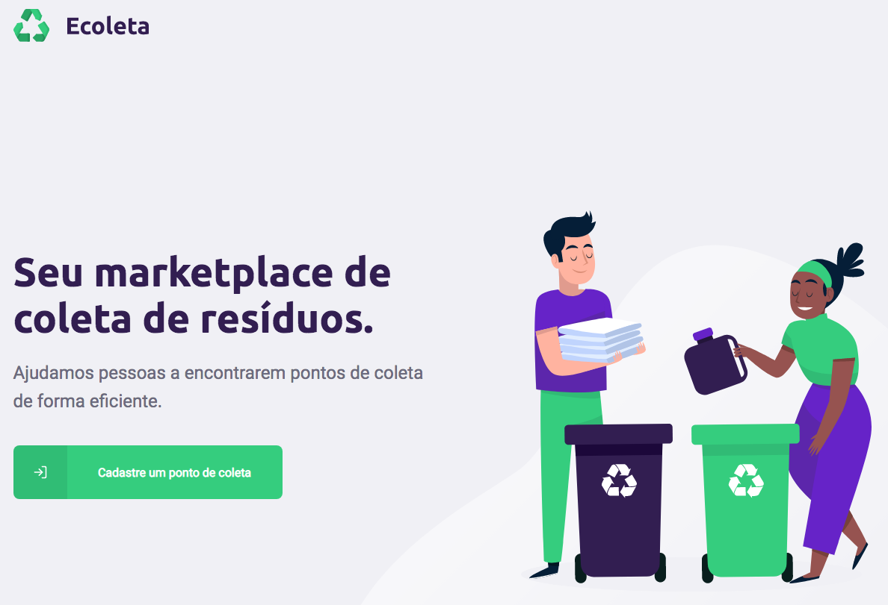

# Ecoleta - Next Level Week
Projeto desenvolvido na **Next Level Week #1** da Rocketseat utilizando ReactJS, React Native e NodeJS.

## Novos aprendizados
- TypeScript
- API de localidades do IBGE
- Utilização de mapas do Leaflet
- Upload de arquivos com utilização de Dropzone

